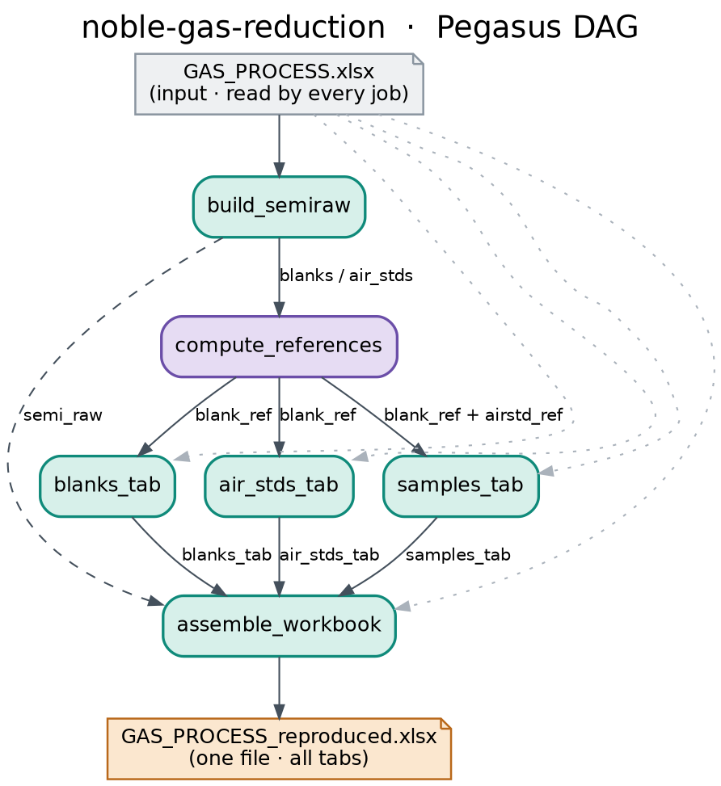

# Noble-gas reduction — Pegasus workflow

Reproduces every **calculated tab** of a `GAS_PROCESS` workbook as a Pegasus
(5.x) workflow. **One** input workbook in → **one** workbook with all tabs out.
The three table builds run **in parallel**. It is **version-independent**: every
job reads the layout, constants, lookup tables and selection *from the workbook
itself*, so the same workflow handles any monthly revision (validated against
the Aug-2024 and Oct-2026 sheets to machine precision, worst diff ~1e-15).

---

## The DAG



```
GAS_PROCESS.xlsx ─(read by every job)─┐
                                      ▼
                                build_semiraw            (join + split by code)
                                      ▼
                              compute_references          (blank_ref + airstd_ref)
                                      │
              ┌───────────────────────┼───────────────────────┐   ◄── PARALLEL
              ▼                        ▼                        ▼
         blanks_tab              air_stds_tab              samples_tab
              └───────────────────────┼───────────────────────┘
                                      ▼
                              assemble_workbook ─► GAS_PROCESS_reproduced.xlsx
```

The concrete abstract workflow is checked in as **`noble-gas-reduction.yml`**
(regenerate any time with `python3 noble_gas_workflow.py`). `dag.dot` / `dag.png`
/ `dag.svg` are the picture above.

**Dependencies are inferred from the files** — there are no manual
`add_dependency` calls. Pegasus creates an edge wherever one job's *output file*
is another job's *input file*. The three tab jobs share no file with one
another, so they run concurrently. The only sequential spine is
`build_semiraw → compute_references → (any tab) → assemble` (four jobs deep,
regardless of how much data each tab processes).

---

## How the workflow works

The Excel workbook is a noble-gas data-reduction pipeline: raw mass-spec beams
→ `Semi Raw` (a join) → split by sample-type code into `Blanks` / `Air STDs` /
`Samples` → the reduction → the reported concentrations and isotope ratios.
Each job below reproduces one stage of that and writes its result to a file; the
file names are the contract that wires the DAG together.

| Job | Reads | Writes | What it does |
|-----|-------|--------|--------------|
| **build_semiraw** | `GAS_PROCESS.xlsx` | `semi_raw.csv`, `blanks.csv`, `air_stds.csv`, `samples.csv` | Joins the five paste tabs into one row-per-run table, then splits the rows by type code (1 = air std, 2 = blank, 3 = sample). |
| **compute_references** | workbook, `blanks.csv`, `air_stds.csv` | `blank_ref.json`, `airstd_ref.json` | Averages the selected blank runs and the bracketing air standards (expanding the workbook's own `AVERAGE()` selection). This is the one sequential step — the air-std reference is blank-corrected, so the blank average must exist first. |
| **blanks_tab** | workbook, `blanks.csv`, `blank_ref.json` | `blanks_tab.csv` | Emits the averaged blank row. *(parallel)* |
| **air_stds_tab** | workbook, `air_stds.csv`, `blank_ref.json` | `air_stds_tab.csv` | Blank-corrects every air-standard beam and forms the ratio columns. *(parallel)* |
| **samples_tab** | workbook, `samples.csv`, `blank_ref.json`, `airstd_ref.json` | `samples_tab.csv` | Reduces every sample to concentrations and isotope ratios. *(parallel)* |
| **assemble_workbook** | workbook, `semi_raw.csv`, the three `*_tab.csv` | `GAS_PROCESS_reproduced.xlsx` | Copies the whole workbook through (every tab, every reference cell) and overlays the recomputed columns → one file with all tabs. |

### Data contracts between jobs

- `semi_raw.csv` / `blanks.csv` / `air_stds.csv` / `samples.csv`
  — header `_row,_code,<join columns…>`, one row per run.
- `blank_ref.json` / `airstd_ref.json`
  — `{"<beam column letter>": <average value>, …}`.
- `blanks_tab.csv` / `air_stds_tab.csv` / `samples_tab.csv`
  — header `sheet,row,col,value`: the cells to overlay during assembly.

### Why it is version-independent

`bin/gaslib.py` never hard-codes a layout. For each output column it **parses
the column's own formula** to recover its wiring (beam column, blank/air-std
reference cells, the air-abundance constant, the split & line lookup tables, the
manometer column, and whether the depletion term is applied), then reads those
constants straight from their cells and expands the blank/air-std `AVERAGE()`
selection (contiguous or not). The calculated columns are recomputed in Python;
all other cells and reference tabs (isotope abundances, lookup tables, raw
beams, manual overrides) are copied through unchanged.

---

## Layout

```
noble-gas-workflow/
├── noble_gas_workflow.py     # generates the DAG (noble-gas-reduction.yml)
├── noble-gas-reduction.yml   # the generated abstract workflow (DAG)
├── pegasus.properties        # generated properties
├── dag.dot / dag.png / dag.svg   # the DAG picture
├── sites.yml                 # site catalog (local; add a cluster site to scale)
├── plan.sh                   # generate -> plan -> submit
├── input/
│   └── GAS_PROCESS.xlsx      # the input workbook (any monthly revision)
└── bin/
    ├── gaslib.py             # shared, version-independent reduction logic
    ├── build_semiraw.py
    ├── compute_references.py
    ├── blanks_tab.py
    ├── air_stds_tab.py
    ├── samples_tab.py
    └── assemble_workbook.py
```

---

## Run

```bash
# the input workbook is already in input/GAS_PROCESS.xlsx
cd noble-gas-workflow
./plan.sh            # generate -> plan -> submit   (needs Pegasus 5.x + HTCondor)
```

The reproduced workbook lands in `output/GAS_PROCESS_reproduced.xlsx`.
Monitor with `pegasus-status -w work/*/*`.

### Run the stages without Pegasus (quick check)

```bash
cd bin
cp ../input/GAS_PROCESS.xlsx .
python3 build_semiraw.py      GAS_PROCESS.xlsx
python3 compute_references.py GAS_PROCESS.xlsx
python3 blanks_tab.py         GAS_PROCESS.xlsx
python3 air_stds_tab.py       GAS_PROCESS.xlsx
python3 samples_tab.py        GAS_PROCESS.xlsx
python3 assemble_workbook.py  GAS_PROCESS.xlsx
# -> GAS_PROCESS_reproduced.xlsx
```

### Regenerate the DAG only

```bash
python3 noble_gas_workflow.py      # rewrites noble-gas-reduction.yml + pegasus.properties
```

---

## Requirements

- Python 3.9+ with `openpyxl`
- `pegasus-wms.api` to generate the DAG; Pegasus 5.x + HTCondor to plan/submit
  (the stage scripts in `bin/` also run standalone, no Pegasus needed)

## Scaling out

The heavy jobs are `air_stds_tab` (~3,000 rows) and `samples_tab` (~1,000 rows).
To parallelise further, shard each into row-chunks with a `split → map → merge`
sub-pattern (N parallel chunk jobs per tab), and add a `condorpool`/`slurm` site
to `sites.yml`.
